# MedsSeva - Healthcare Diagnostics Platform

> **Diagnostics at Your Doorstep**

MedsSeva is a comprehensive healthcare diagnostics platform that connects patients with pathology laboratories and home sample collection services across urban and semi-urban regions. The platform combines a mobile application, backend API, and an administrative panel — fully backend-driven and production-ready.

---

## Download the App

Visit the MedsSeva website to download the latest Android APK:

https://medsseva-app.onrender.com

> Download the Android APK directly from the website and start using MedsSeva on your device.

---

## Platform Components

| Component | Description |
|---|---|
| **Mobile App** | For patients: book tests, track status, view reports. For partners: manage bookings, collect samples, and handle delivery |
| **Admin Panel** | Web-based operations panel for staff, bookings, reports, and analytics |
| **Backend API** | Node.js + PostgreSQL API layer powering both clients |

---

## Features

### Authentication

- Email/password and OTP-based login
- JWT access and refresh token system
- Role-based access control (Super Admin, Sub Admin roles)
- Account type selection at signup (Patient / Partner)

### Booking System

- Unified booking flow for **Home Collection** and **Lab Visit** modes
- Auto-prefill of patient details from user profile
- Real-time appointment slot validation — past slots blocked at both frontend and backend
- Single canonical Booking ID across app, tracking page, and admin panel
- Dynamic booking status timeline synced from the database
- Complete patient details saved and visible in admin panel

### Lab Visit Workflow

- Separate workflow for Lab Visit vs Home Collection
- "I Reached the Lab" action triggers real-time admin notification
- Payment gate: Sample collection starts only after payment confirmed
- Booking rejection handled in real time with push notification and timeline update
- Timeline stages: Booking → Payment → Arrival → Sample Collection → Report → Delivery

### Report Management

- Dynamic report generation from real database content
- Admin editable report fields: patient info, test results, reference ranges, clinical flags, physician remarks
- Cloudinary integration for permanent report storage
- Consistent report URL across admin and patient views
- In-app report viewing and native PDF download
- Push notification when report is ready

### SevaBot — Hybrid AI + Human Support

- AI-powered chatbot using Grok API
- Real-time backend data: test catalogue, packages, offers, booking status, report links, branches
- Escalation to live customer support executive when AI confidence is low
- "Connect with Customer Support" button always visible in chat
- Full conversation history transferred to support executive on escalation
- User notified when a human executive joins

### Customer Support Module

- Live chat between users and support executives via admin panel
- Queue interface for incoming and escalated conversations
- Real-time messaging (polling / websocket)
- Message threading: User / SevaBot / Executive visually distinct

### Admin Panel

- Super Admin and Sub Admin hierarchy
- Configurable roles: Laboratory Manager, Pathology Manager, and others
- Role-based access enforced at both API and UI level
- Dynamic branch management — no code deployment needed for branch updates
- CRM module with real customer records, booking history, and report access
- Inventory tracking: stock movements, consumption analytics, reorder alerts
- Platform analytics: real user counts, booking trends, report volumes
- API monitoring: response times, error rates, request volumes
- Notification management: compose and send push notifications to user segments

### Payment

- QR Code (UPI) and Razorpay (card, net banking, UPI) payment methods
- Payment records stored in PostgreSQL payments table
- Payment status transitions tracked in real time
- RBAC-corrected endpoint access for payment link generation

### Push Notifications

- Firebase Cloud Messaging (FCM) for push delivery
- Handles Foreground, Background, and Terminated app states
- Deep linking: notification tap routes directly to relevant screen
- Notification history and delivery logs in admin panel
- Notification triggers: booking confirmation, status updates, report ready, executive assignment

---

## Tech Stack

| Layer | Technology |
|---|---|
| Mobile App | React Native, Expo, TypeScript |
| Admin Panel | React.js, Vite |
| Backend | Node.js, Express.js |
| ORM | Prisma |
| Database | PostgreSQL |
| Authentication | JWT |
| Image / File Storage | Cloudinary |
| AI Chatbot | Grok API |
| Payment Gateway | Razorpay |
| Push Notifications | FCM |

---

## Database

- Fully normalised schema with Prisma ORM
- Models: Users, Bookings, Tests, Categories, Packages, Branches, Reports, Executives, Staff, Inventory, Payments
- Foreign key constraints and indices for referential integrity
- Prisma seed script for initial test catalogue, packages, offers, and pricing
- All business data managed through admin panel — no code deployment required for content updates

---

## Screenshots

### Patient App

  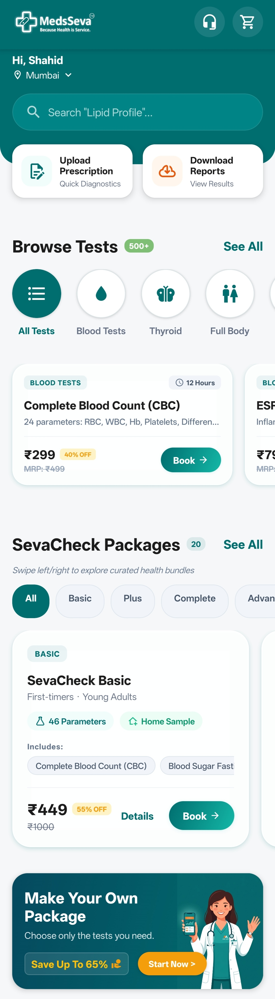&nbsp;
  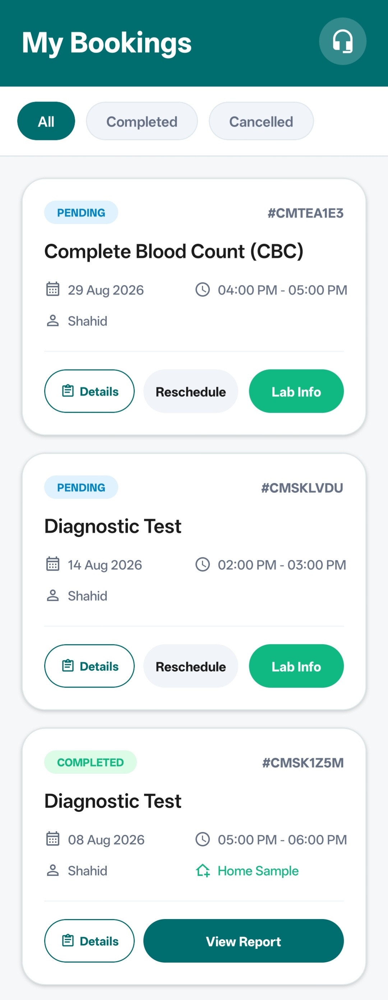&nbsp;
  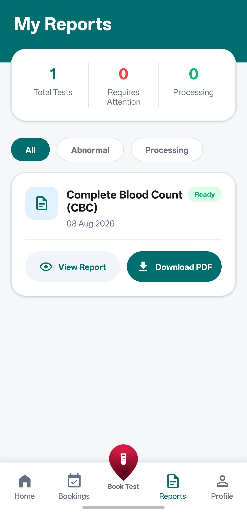&nbsp;
  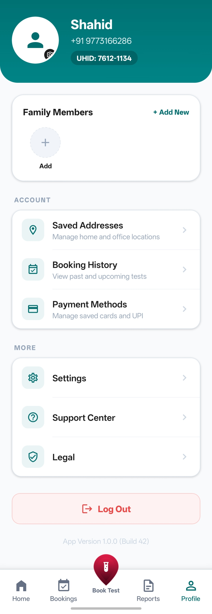

  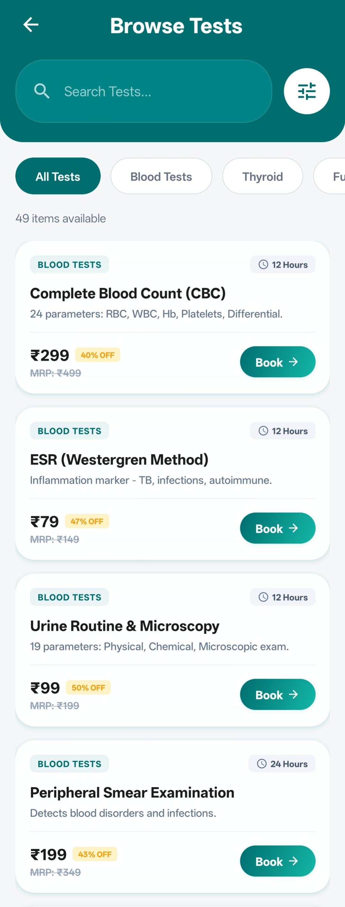&nbsp;
  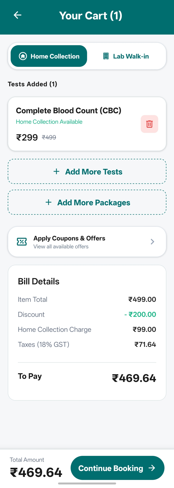&nbsp;
  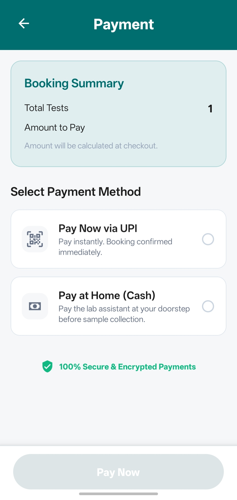

### Partner App

  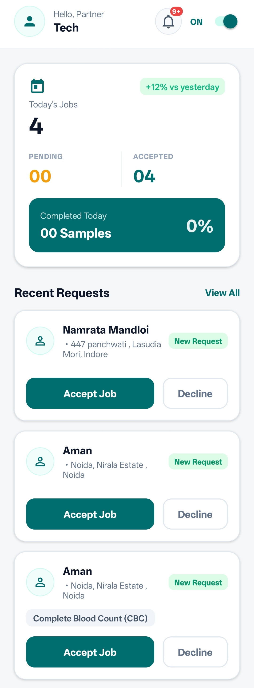&nbsp;
  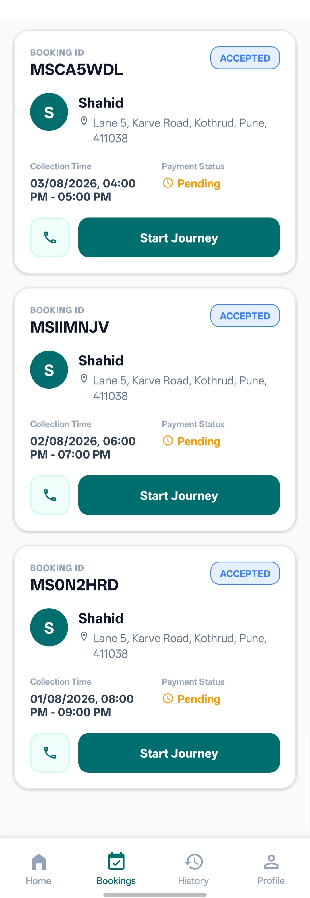&nbsp;
  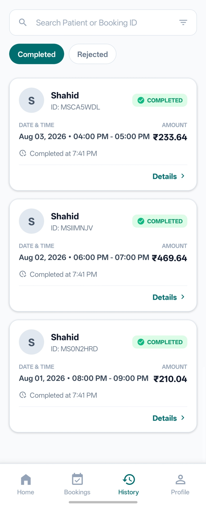&nbsp;
  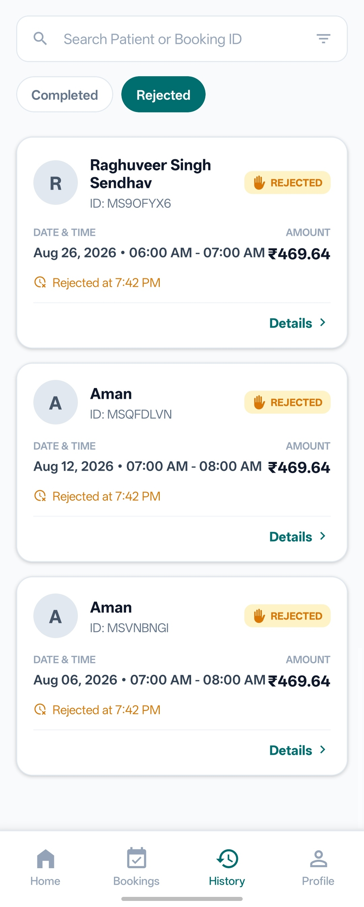&nbsp;
  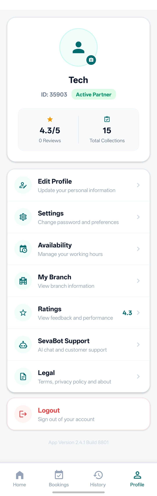

### Admin Panel

  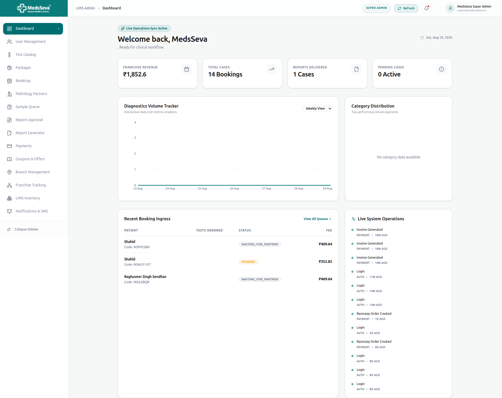

---

## Author

**Shahiduddin (Shaho)**

Email: [shahiduddin153@gmail.com](mailto:shahiduddin153@gmail.com)

---

*Built during internship at Zenvora Infotech*